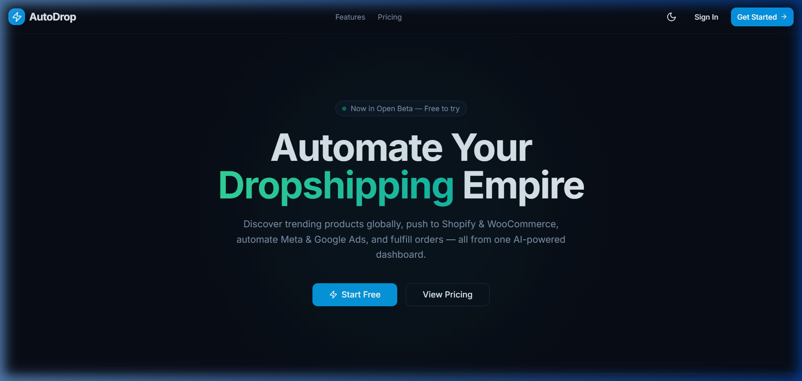
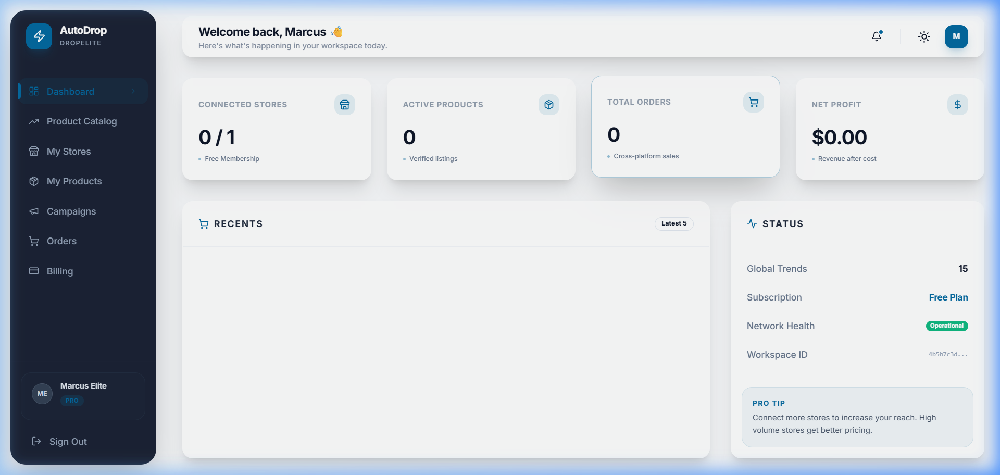
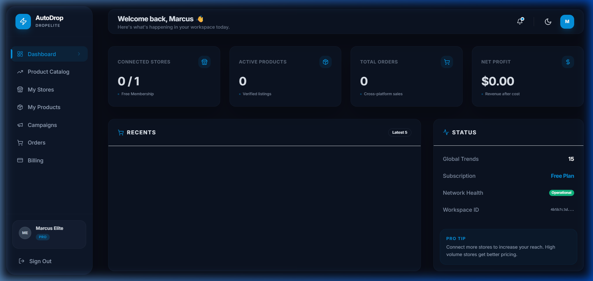
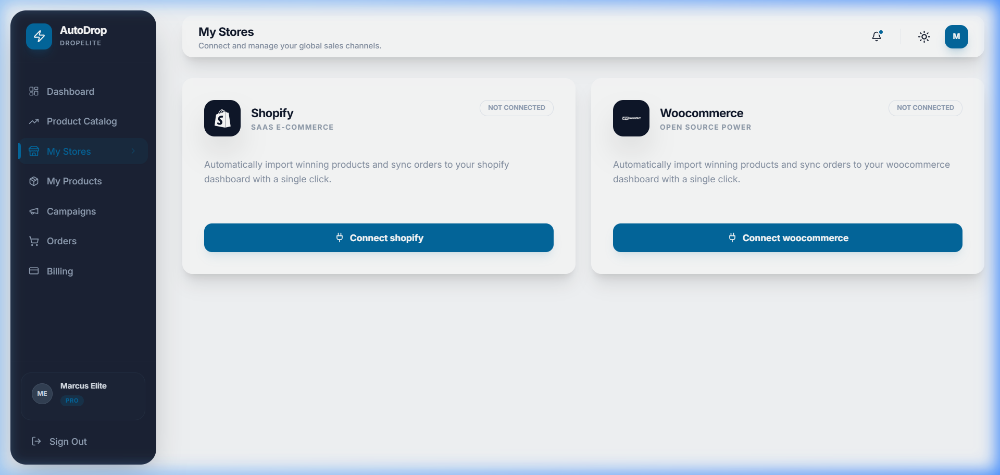
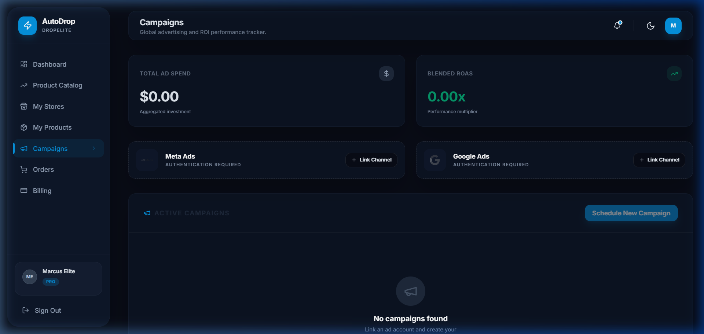

# AutoDrop — Smart Dropshipping SaaS 🚀

AutoDrop is a premium, high-performance dropshipping SaaS platform designed to automate product discovery, store synchronization, and advertising scaling. Built with a modern **Glassmorphism Design System**, it provides a seamless and elegant experience for entrepreneurs.



## ✨ Features

-   **Glassmorphism UI:** A state-of-the-art, minimal, and elegant interface with full Dark Mode support.
-   **Multi-Store Integration:** Connect and manage Shopify and WooCommerce sales channels from a single dashboard.
-   **Global Product Catalog:** Discover winning products with built-in ROI scoring and multi-factor analysis.
-   **Automated Logistics:** Track orders, profit margins, and fulfillment health across all distribution nodes.
-   **Marketing Hub:** Scale your reach with integrated Meta and Google Ads performance tracking.
-   **Enterprise Billing:** Managed resource allocation and flexible subscription tiers.

## 🛠️ Tech Stack

-   **Frontend:** React, TypeScript, Vite, Tailwind CSS, Shadcn UI, Lucide Icons.
-   **Backend:** Python (Flask), SQLAlchemy, PostgreSQL, Redis, Celery (Background Tasks).
-   **Infrastructure:** Docker, Docker Compose.

## 🚀 Quick Start

### 1. Requirements
Ensure you have **Docker** and **Node.js** installed on your system.

### 2. Launch Environment
```bash
# Start the backend services (Postgres, Redis, Flask, Celery)
docker-compose up -d

# Install frontend dependencies
cd frontend
npm install

# Start development server
npm run dev
```

### 3. Default Credentials (Seeded)
The platform comes pre-seeded with test data. Use the following credentials to explore:

| Plan Tier | Email | Password |
| :--- | :--- | :--- |
| **Pro (Elite)** | `owner@dropelite.io` | `Password123!` |
| **Starter** | `owner@trendvault.io` | `Password123!` |

## 📸 Visual Preview

### Dashboard (Light Mode)


### Dashboard (Dark Mode)


### Store Management


### Performance Tracking


---

Developed with ❤️ by the AutoDrop Team.
