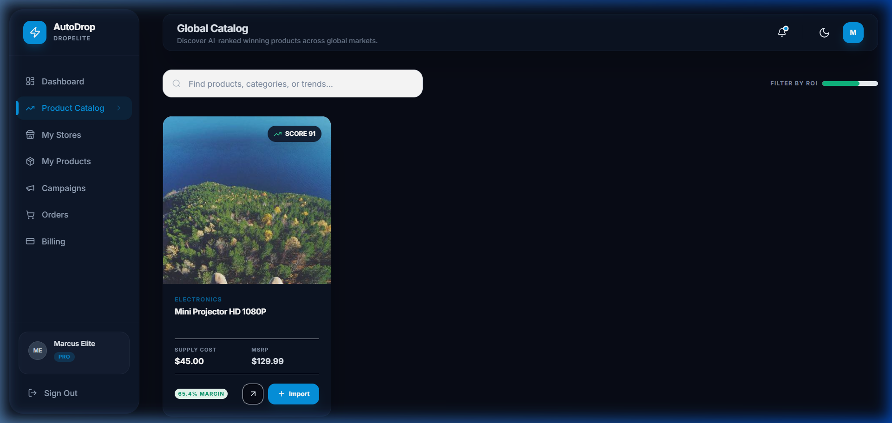
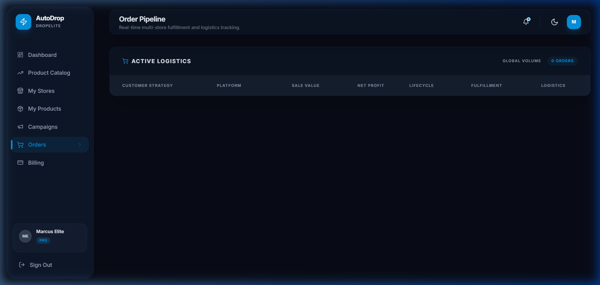
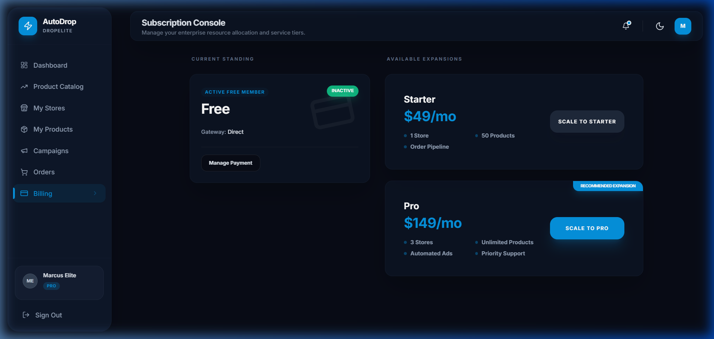

# AutoDrop — Enterprise User Guide 📖

This guide provides a detailed walkthrough of the AutoDrop platform, its modules, and the core user flows for scaling a dropshipping business.

---

## 1. Authentication & Tenant Access
AutoDrop is a multi-tenant SaaS. Access is restricted to registered business owners.

- **Login URL:** `/login`
- **Security:** JWT-based authentication with secure cookie persistence.
- **Tenant Isolation:** All data (Products, Campaigns, Orders) is isolated at the `tenant_id` level.

---

## 2. Dashboard Hub
The Dashboard provides a 360-degree view of your dropshipping empire.

- **Revenue Visualization:** Track daily, weekly, and monthly growth.
- **Node Status:** Real-time monitoring of connected store health.
- **Action Items:** Quick access to pending orders and low-stock alerts.

---

## 3. Product Catalog & Inventory
AutoDrop comes with a built-in global product Discovery Engine.

- **One-Click Import:** Import products from the global catalog directly to your Shopify/WooCommerce stores.
- **Pricing Strategy:** Automated margin calculation based on supplier costs and target ROI.
- **Sync Status:** Real-time synchronization of inventory levels across all sales channels.

---

## 4. Ads & Performance Scaling
Manage your marketing budget across multiple platforms.

- **Integrated Platforms:** Supports Meta (Facebook/Instagram) and Google Ads.
- **Blended ROAS:** Unified view of marketing performance across all ad accounts.
- **Campaign Insights:** Track individual campaign conversions, budgets, and efficiency.

---

## 5. Order Pipeline & Logistics
Automated fulfillment and logistics tracking.

- **Logistics Lifecycle:** Monitor orders from 'Pending' through 'Delivered'.
- **Profit Tracking:** Real-time net profit calculation for every sale, accounting for COGS and ad spend.
- **Tracking Integration:** Direct links to international tracking services for customers.

---

## 6. Billing & Resource Management
Manage your enterprise scaling with flexible subscription tiers.

- **Resource Nodes:** Monitor your 'Distribution Node' and 'Inventory SKU' limits.
- **Scaling:** Upgrade tiers instantly to increase store and product capacity.
- **Gateway Management:** Secure billing via integrated payment gateways.

---

## 7. Developer & Admin Info
For developers working on the AutoDrop codebase:

- **Database Seeds:** Ensure all seeds from `backend/seed.py` are applied to your local environment.
- **API Documentation:** REST API endpoints are located at `/api/v1/`.
- **Background Tasks:** Use Redis and Celery for asynchronous operations like ad syncing and product imports.

---

© 2025 AutoDrop SaaS. All rights reserved.
